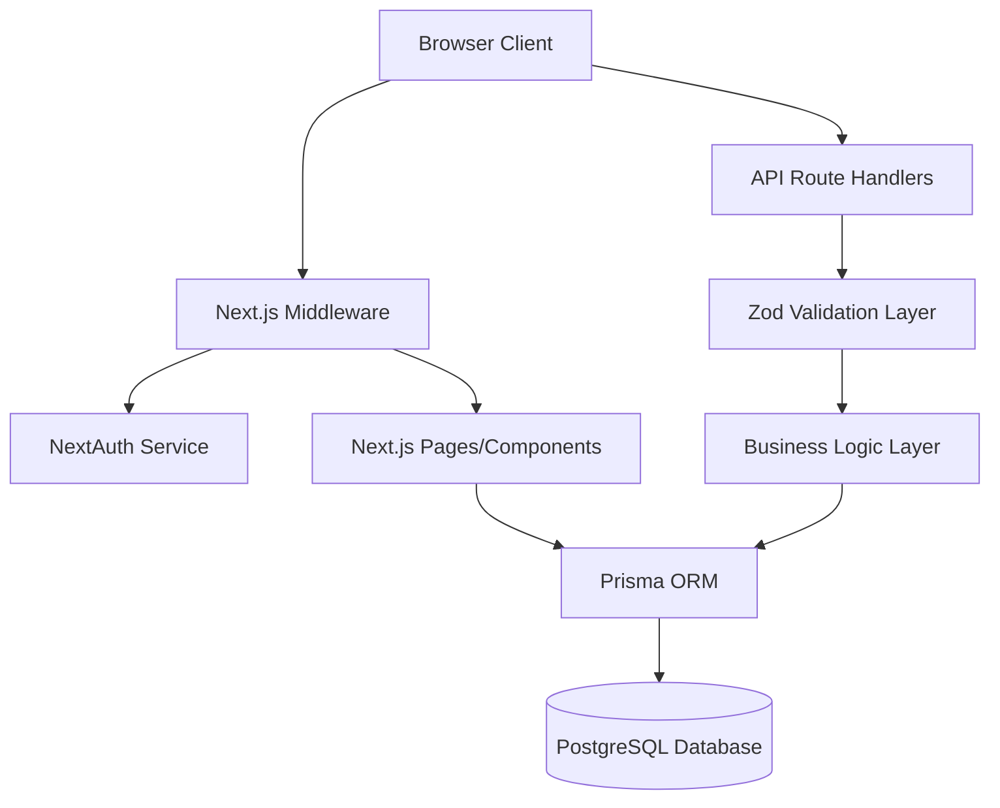
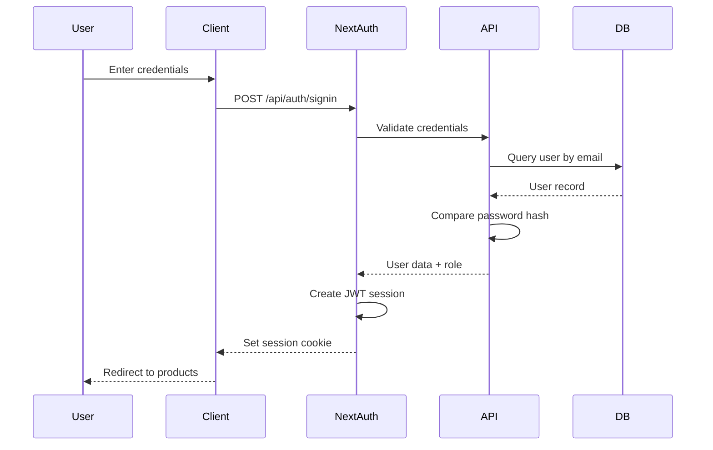
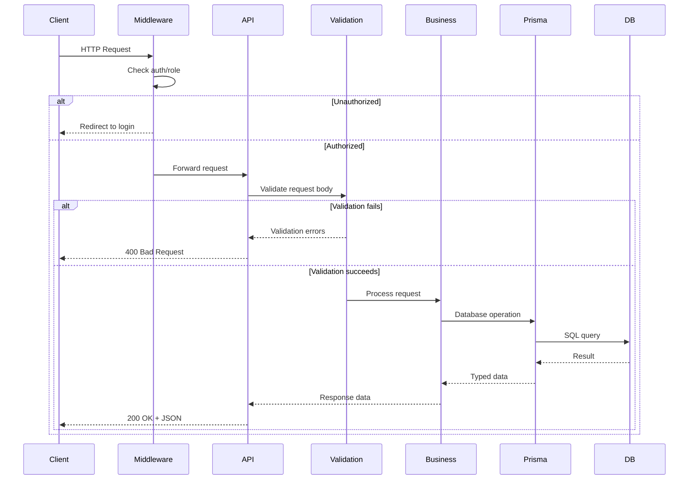

# Design Document: ShopNexus Ecommerce Application

## Overview

ShopNexus is a full-stack ecommerce application built with Next.js 16 (App Router), TypeScript, PostgreSQL, and Prisma ORM. The system provides a complete shopping experience with user authentication, product browsing, cart management, and order processing. The architecture follows Next.js best practices with server-side rendering, API routes, and middleware-based authentication.

### Technology Stack

- **Frontend**: Next.js 16 (App Router), React 19, TailwindCSS 4
- **Backend**: Next.js API Routes (Route Handlers)
- **Database**: PostgreSQL with Prisma ORM 7.4
- **Authentication**: NextAuth.js with JWT strategy
- **Validation**: Zod schemas
- **Password Hashing**: bcrypt
- **Testing**: Property-based testing with fast-check

### Key Design Principles

1. **Type Safety**: End-to-end TypeScript with Prisma-generated types
2. **Server-First**: Leverage Next.js server components and server actions
3. **Security**: Middleware-based route protection, password hashing, input validation
4. **Data Integrity**: Database constraints, transaction support, stock management
5. **Testability**: Property-based testing for correctness guarantees

## Architecture

### High-Level Architecture



### Layer Responsibilities

**Presentation Layer (Client)**
- React components for UI rendering
- Form handling and client-side validation
- Navigation and routing

**Middleware Layer**
- Route protection based on authentication status
- Role-based authorization (USER vs ADMIN)
- Session validation

**API Layer (Route Handlers)**
- RESTful endpoints for CRUD operations
- Request validation with Zod
- Error handling and response formatting
- Business logic orchestration

**Data Access Layer (Prisma)**
- Database queries and mutations
- Transaction management
- Type-safe database operations

**Database Layer (PostgreSQL)**
- Data persistence
- Referential integrity
- Constraints and indexes

### Authentication Flow



### Request Flow



## Components and Interfaces

### Directory Structure

```
src/
├── app/
│   ├── (auth)/
│   │   ├── login/
│   │   │   └── page.tsx
│   │   └── register/
│   │       └── page.tsx
│   ├── (protected)/
│   │   ├── products/
│   │   │   ├── page.tsx
│   │   │   └── [id]/
│   │   │       └── page.tsx
│   │   ├── cart/
│   │   │   └── page.tsx
│   │   └── orders/
│   │       ├── page.tsx
│   │       └── [id]/
│   │           └── page.tsx
│   ├── admin/
│   │   ├── products/
│   │   │   ├── page.tsx
│   │   │   ├── new/
│   │   │   │   └── page.tsx
│   │   │   └── [id]/
│   │   │       └── edit/
│   │   │           └── page.tsx
│   │   └── orders/
│   │       └── page.tsx
│   ├── api/
│   │   ├── auth/
│   │   │   └── [...nextauth]/
│   │   │       └── route.ts
│   │   ├── register/
│   │   │   └── route.ts
│   │   ├── products/
│   │   │   ├── route.ts
│   │   │   └── [id]/
│   │   │       └── route.ts
│   │   ├── cart/
│   │   │   ├── route.ts
│   │   │   └── [id]/
│   │   │       └── route.ts
│   │   └── orders/
│   │       ├── route.ts
│   │       └── [id]/
│   │           └── route.ts
│   ├── layout.tsx
│   ├── page.tsx
│   └── middleware.ts
├── core/
│   ├── lib/
│   │   ├── prisma.ts
│   │   ├── auth.ts
│   │   └── bcrypt.ts
│   ├── schemas/
│   │   ├── user.schema.ts
│   │   ├── product.schema.ts
│   │   ├── cart.schema.ts
│   │   └── order.schema.ts
│   ├── services/
│   │   ├── user.service.ts
│   │   ├── product.service.ts
│   │   ├── cart.service.ts
│   │   └── order.service.ts
│   └── types/
│       └── next-auth.d.ts
└── generated/
    └── prisma/
```

### Core Components

#### 1. Authentication Service (`core/lib/auth.ts`)

```typescript
interface AuthConfig {
  providers: Provider[];
  session: {
    strategy: 'jwt';
  };
  callbacks: {
    jwt: (params) => Promise<JWT>;
    session: (params) => Promise<Session>;
  };
  pages: {
    signIn: string;
  };
}
```

**Responsibilities:**
- Configure NextAuth with credentials provider
- Handle JWT token creation and validation
- Include user role in session
- Define custom sign-in page

#### 2. Middleware (`app/middleware.ts`)

```typescript
interface MiddlewareConfig {
  matcher: string[];
}

function middleware(request: NextRequest): NextResponse;
```

**Responsibilities:**
- Protect routes requiring authentication
- Enforce role-based access control
- Redirect unauthenticated users to login
- Block unauthorized access to admin routes

**Protected Routes:**
- `/products/*` - Requires authentication
- `/cart/*` - Requires authentication
- `/orders/*` - Requires authentication
- `/admin/*` - Requires ADMIN role

#### 3. Validation Schemas (`core/schemas/`)

**User Schema:**
```typescript
const registerSchema = z.object({
  name: z.string().min(1),
  email: z.string().email(),
  password: z.string().min(8)
});

const loginSchema = z.object({
  email: z.string().email(),
  password: z.string().min(1)
});
```

**Product Schema:**
```typescript
const createProductSchema = z.object({
  name: z.string().min(1),
  description: z.string(),
  price: z.number().positive(),
  stock: z.number().int().nonnegative()
});

const updateProductSchema = createProductSchema.partial();
```

**Cart Schema:**
```typescript
const addToCartSchema = z.object({
  productId: z.string().uuid(),
  quantity: z.number().int().positive()
});

const updateCartItemSchema = z.object({
  quantity: z.number().int().positive()
});
```

**Order Schema:**
```typescript
const createOrderSchema = z.object({
  items: z.array(z.object({
    productId: z.string().uuid(),
    quantity: z.number().int().positive()
  })).min(1)
});

const updateOrderStatusSchema = z.object({
  status: z.enum(['PENDING', 'PAID'])
});
```

#### 4. Service Layer (`core/services/`)

**User Service:**
```typescript
interface UserService {
  createUser(data: RegisterInput): Promise<User>;
  findUserByEmail(email: string): Promise<User | null>;
  validatePassword(password: string, hash: string): Promise<boolean>;
}
```

**Product Service:**
```typescript
interface ProductService {
  getAllProducts(): Promise<Product[]>;
  getProductById(id: string): Promise<Product | null>;
  createProduct(data: CreateProductInput): Promise<Product>;
  updateProduct(id: string, data: UpdateProductInput): Promise<Product>;
  deleteProduct(id: string): Promise<void>;
  checkStock(id: string, quantity: number): Promise<boolean>;
}
```

**Cart Service:**
```typescript
interface CartService {
  getCart(userId: string): Promise<CartItem[]>;
  addToCart(userId: string, productId: string, quantity: number): Promise<CartItem>;
  updateCartItem(userId: string, itemId: string, quantity: number): Promise<CartItem>;
  removeFromCart(userId: string, itemId: string): Promise<void>;
  clearCart(userId: string): Promise<void>;
}
```

**Order Service:**
```typescript
interface OrderService {
  createOrder(userId: string, items: OrderItemInput[]): Promise<Order>;
  getUserOrders(userId: string): Promise<Order[]>;
  getAllOrders(): Promise<Order[]>;
  getOrderById(id: string): Promise<Order | null>;
  updateOrderStatus(id: string, status: OrderStatus): Promise<Order>;
}
```

### API Endpoints

#### Authentication Endpoints

**POST /api/auth/[...nextauth]**
- Handled by NextAuth
- Supports signin, signout, session endpoints

**POST /api/register**
- Request: `{ name, email, password }`
- Response: `{ message: "User created successfully" }`
- Errors: 400 (validation), 409 (email exists), 500 (server error)

#### Product Endpoints

**GET /api/products**
- Query params: None
- Response: `Product[]`
- Auth: Required

**GET /api/products/[id]**
- Response: `Product`
- Errors: 404 (not found)
- Auth: Required

**POST /api/products**
- Request: `{ name, description, price, stock }`
- Response: `Product`
- Errors: 400 (validation), 403 (not admin)
- Auth: Required (ADMIN)

**PATCH /api/products/[id]**
- Request: `Partial<{ name, description, price, stock }>`
- Response: `Product`
- Errors: 400 (validation), 403 (not admin), 404 (not found)
- Auth: Required (ADMIN)

**DELETE /api/products/[id]**
- Response: `{ message: "Product deleted" }`
- Errors: 403 (not admin), 404 (not found), 409 (has orders)
- Auth: Required (ADMIN)

#### Cart Endpoints

**GET /api/cart**
- Response: `CartItem[]`
- Auth: Required

**POST /api/cart**
- Request: `{ productId, quantity }`
- Response: `CartItem`
- Errors: 400 (validation, insufficient stock)
- Auth: Required

**PATCH /api/cart/[id]**
- Request: `{ quantity }`
- Response: `CartItem`
- Errors: 400 (validation, insufficient stock), 404 (not found)
- Auth: Required

**DELETE /api/cart/[id]**
- Response: `{ message: "Item removed" }`
- Errors: 404 (not found)
- Auth: Required

#### Order Endpoints

**GET /api/orders**
- Response: `Order[]` (user's orders or all orders if admin)
- Auth: Required

**GET /api/orders/[id]**
- Response: `Order` (with OrderItems)
- Errors: 404 (not found), 403 (not owner and not admin)
- Auth: Required

**POST /api/orders**
- Request: `{ items: [{ productId, quantity }] }`
- Response: `Order`
- Errors: 400 (validation, insufficient stock), 500 (transaction failed)
- Auth: Required

**PATCH /api/orders/[id]**
- Request: `{ status }`
- Response: `Order`
- Errors: 400 (validation), 403 (not admin), 404 (not found)
- Auth: Required (ADMIN)

## Data Models

### Prisma Schema

```prisma
generator client {
  provider = "prisma-client"
  output   = "../src/generated/prisma"
}

datasource db {
  provider = "postgresql"
  url      = env("DATABASE_URL")
}

enum Role {
  USER
  ADMIN
}

enum OrderStatus {
  PENDING
  PAID
}

model User {
  id        String   @id @default(uuid())
  name      String
  email     String   @unique
  password  String
  role      Role     @default(USER)
  createdAt DateTime @default(now())
  
  orders    Order[]
  cartItems CartItem[]
  
  @@map("users")
}

model Product {
  id          String   @id @default(uuid())
  name        String
  description String
  price       Decimal  @db.Decimal(10, 2)
  stock       Int
  createdAt   DateTime @default(now())
  
  orderItems  OrderItem[]
  cartItems   CartItem[]
  
  @@map("products")
}

model Order {
  id          String      @id @default(uuid())
  userId      String
  totalAmount Decimal     @db.Decimal(10, 2)
  status      OrderStatus @default(PENDING)
  createdAt   DateTime    @default(now())
  
  user        User        @relation(fields: [userId], references: [id])
  items       OrderItem[]
  
  @@index([userId])
  @@map("orders")
}

model OrderItem {
  id        String  @id @default(uuid())
  orderId   String
  productId String
  quantity  Int
  price     Decimal @db.Decimal(10, 2)
  
  order     Order   @relation(fields: [orderId], references: [id], onDelete: Cascade)
  product   Product @relation(fields: [productId], references: [id])
  
  @@index([orderId])
  @@index([productId])
  @@map("order_items")
}

model CartItem {
  id        String   @id @default(uuid())
  userId    String
  productId String
  quantity  Int
  createdAt DateTime @default(now())
  
  user      User     @relation(fields: [userId], references: [id], onDelete: Cascade)
  product   Product  @relation(fields: [productId], references: [id])
  
  @@unique([userId, productId])
  @@index([userId])
  @@map("cart_items")
}
```

### Data Model Relationships

**User → Order**: One-to-Many
- A user can have multiple orders
- Each order belongs to one user
- Cascade delete not enabled (preserve order history)

**User → CartItem**: One-to-Many
- A user can have multiple cart items
- Each cart item belongs to one user
- Cascade delete enabled (cart cleared when user deleted)

**Order → OrderItem**: One-to-Many
- An order contains multiple order items
- Each order item belongs to one order
- Cascade delete enabled (items deleted with order)

**Product → OrderItem**: One-to-Many
- A product can appear in multiple order items
- Each order item references one product
- No cascade delete (preserve order history)

**Product → CartItem**: One-to-Many
- A product can be in multiple carts
- Each cart item references one product
- No cascade delete (cart items removed separately)

### Database Constraints

1. **Unique Constraints:**
   - User email must be unique
   - CartItem (userId, productId) combination must be unique

2. **Indexes:**
   - Order.userId for efficient user order queries
   - OrderItem.orderId for efficient order item lookups
   - OrderItem.productId for product reference queries
   - CartItem.userId for efficient cart queries

3. **Data Types:**
   - UUIDs for all primary keys
   - Decimal(10,2) for monetary values (price, totalAmount)
   - Int for quantities and stock
   - DateTime with default now() for timestamps

### Seed Data

The seed script (`prisma/seed.ts`) will create:

**Users:**
- Admin user: admin@shopnexus.com (role: ADMIN)
- Test user: user@shopnexus.com (role: USER)
- Both with bcrypt-hashed passwords

**Products:**
- At least 5 products with varying:
  - Prices: $10 - $500
  - Stock levels: 0 - 100
  - Categories: Electronics, Clothing, Books, etc.


## Correctness Properties

*A property is a characteristic or behavior that should hold true across all valid executions of a system—essentially, a formal statement about what the system should do. Properties serve as the bridge between human-readable specifications and machine-verifiable correctness guarantees.*

### Property Reflection

After analyzing all acceptance criteria, several redundancies were identified:
- Properties 1.2 and 10.5 both test duplicate email rejection (consolidated into Property 1)
- Properties 11.2 and 12.2 both test validation error responses (consolidated into Property 11)
- Properties testing specific examples (registration redirect, login redirect, middleware configuration, seed script) are grouped as integration tests rather than universal properties
- Schema structure requirements (10.1-10.4) are design constraints, not runtime behaviors

The following properties represent unique, testable behaviors that provide comprehensive correctness guarantees.

### Authentication Properties

#### Property 1: User Registration Creates Hashed Password

*For any* valid registration data (name, email, password), when a user registers, the system should create a user record where the stored password is a bcrypt hash (not plaintext) and the email is unique in the database.

**Validates: Requirements 1.1, 1.2, 1.3, 10.5**

#### Property 2: Invalid Registration Data Rejected

*For any* registration data with invalid email format or password shorter than 8 characters, the system should reject the registration and return a validation error.

**Validates: Requirements 1.5**

#### Property 3: Valid Credentials Create Session

*For any* registered user, when authenticating with correct credentials, the system should create a JWT session containing the user's ID and role.

**Validates: Requirements 2.1, 2.5**

#### Property 4: Invalid Credentials Rejected

*For any* registered user, when authenticating with incorrect password, the system should reject authentication and return an error without creating a session.

**Validates: Requirements 2.2**

### Authorization Properties

#### Property 5: Unauthenticated Access Blocked

*For any* protected route (/products, /cart, /orders, /admin), when accessed without authentication, the middleware should redirect to the login page.

**Validates: Requirements 3.1**

#### Property 6: Role-Based Access Control

*For any* user with USER role, when attempting to access admin routes (/admin/*), the middleware should block access and return a 403 error.

**Validates: Requirements 3.2**

#### Property 7: Admin Access Granted

*For any* user with ADMIN role, when accessing admin routes (/admin/*), the middleware should allow access.

**Validates: Requirements 3.3**

### Product Catalog Properties

#### Property 8: Product Listing Contains All Fields

*For any* set of products in the database, when retrieving the product list, each product should include name, description, price, and stock fields.

**Validates: Requirements 4.1**

#### Property 9: Zero Stock Indicated

*For any* product with stock equal to 0, when retrieving product information, the system should indicate the product is out of stock.

**Validates: Requirements 4.2**

#### Property 10: Products Ordered By Creation Date

*For any* set of products created at different times, when retrieving the product list, products should be ordered by creation date (oldest first).

**Validates: Requirements 4.3**

### Product Management Properties

#### Property 11: Product Creation Succeeds

*For any* valid product data (name, description, positive price, non-negative stock), when an admin creates a product, the system should create a product record with all provided fields.

**Validates: Requirements 5.1**

#### Property 12: Product Update Persists Changes

*For any* existing product and valid update data, when an admin updates the product, the system should persist the changes and return the updated product.

**Validates: Requirements 5.2**

#### Property 13: Product Deletion Removes Record

*For any* product without associated orders, when an admin deletes the product, the system should remove the product record from the database.

**Validates: Requirements 5.3**

#### Property 14: Invalid Product Data Rejected

*For any* product data with negative price or negative stock, the system should reject the operation and return a validation error.

**Validates: Requirements 5.4**

#### Property 15: Product With Orders Cannot Be Deleted

*For any* product that has associated order items, when an admin attempts to delete the product, the system should prevent deletion and return an error.

**Validates: Requirements 5.5**

### Shopping Cart Properties

#### Property 16: Add To Cart Stores Item

*For any* valid product and positive quantity, when a user adds the item to cart, the system should store a cart item with the product ID and quantity.

**Validates: Requirements 6.1**

#### Property 17: Insufficient Stock Rejected

*For any* product and quantity exceeding available stock, when a user attempts to add to cart, the system should reject the operation and return an error.

**Validates: Requirements 6.2**

#### Property 18: Cart Quantity Update Persists

*For any* existing cart item and new positive quantity, when a user updates the quantity, the system should persist the new quantity.

**Validates: Requirements 6.3**

#### Property 19: Cart Item Removal Deletes Record

*For any* existing cart item, when a user removes it from cart, the system should delete the cart item record.

**Validates: Requirements 6.4**

#### Property 20: Cart Persists Across Sessions

*For any* cart items added by a user, when the user logs out and logs back in, the cart should contain the same items with the same quantities.

**Validates: Requirements 6.5**

### Order Placement Properties

#### Property 21: Order Creation Sets Pending Status

*For any* valid order items, when a user creates an order, the system should create an order record with status PENDING.

**Validates: Requirements 7.1**

#### Property 22: Order Items Created From Cart

*For any* cart items, when a user creates an order, the system should create order item records matching each cart item's product and quantity.

**Validates: Requirements 7.2**

#### Property 23: Order Total Calculated Correctly

*For any* order with multiple items, the order's total amount should equal the sum of (item price × item quantity) for all order items.

**Validates: Requirements 7.3**

#### Property 24: Stock Reduced By Order Quantity

*For any* product with initial stock S and ordered quantity Q, after order creation, the product's stock should equal S - Q.

**Validates: Requirements 7.4**

#### Property 25: Insufficient Stock Prevents Order

*For any* order containing an item with quantity exceeding available stock, the system should reject the entire order and return an error.

**Validates: Requirements 7.5**

#### Property 26: Successful Order Clears Cart

*For any* user with cart items, when an order is successfully created, the user's cart should be empty.

**Validates: Requirements 7.6**

### Order Viewing Properties

#### Property 27: User Sees Only Own Orders

*For any* user, when retrieving orders, the system should return only orders where the userId matches the authenticated user's ID.

**Validates: Requirements 8.1**

#### Property 28: Order Details Include All Fields

*For any* order, when retrieving order details, the response should include products, quantities, prices, total amount, and status.

**Validates: Requirements 8.2**

#### Property 29: Orders Ordered By Date Descending

*For any* set of orders created at different times, when retrieving orders, they should be ordered by creation date (newest first).

**Validates: Requirements 8.3**

#### Property 30: Order Includes All Order Items

*For any* order with multiple items, when retrieving order details, all associated order item records should be included.

**Validates: Requirements 8.4**

### Order Management Properties

#### Property 31: Admin Sees All Orders

*For any* admin user, when retrieving orders, the system should return orders from all users, not just the admin's own orders.

**Validates: Requirements 9.1**

#### Property 32: Order Status Update Persists

*For any* order and valid status value (PENDING or PAID), when an admin updates the order status, the system should persist the new status.

**Validates: Requirements 9.2**

#### Property 33: Invalid Order Status Rejected

*For any* order status value other than PENDING or PAID, the system should reject the status update and return a validation error.

**Validates: Requirements 9.3**

#### Property 34: Status Transition PENDING to PAID Allowed

*For any* order with status PENDING, when an admin updates the status to PAID, the system should allow the transition and persist the change.

**Validates: Requirements 9.4**

### Database Schema Properties

#### Property 35: Record IDs Are Valid UUIDs

*For any* created user, product, or order, the generated ID should be a valid UUID format.

**Validates: Requirements 10.6**

#### Property 36: Foreign Key Integrity Enforced

*For any* attempt to create an order with non-existent userId, or order item with non-existent orderId or productId, the database should reject the operation.

**Validates: Requirements 10.7**

### API Validation Properties

#### Property 37: Invalid Request Data Returns 400

*For any* API endpoint, when receiving a request with data that fails schema validation, the system should return a 400 status code with descriptive error messages.

**Validates: Requirements 11.1, 11.2, 12.2**

### Error Handling Properties

#### Property 38: Authorization Errors Return 403

*For any* API endpoint requiring specific permissions, when accessed by a user without those permissions, the system should return a 403 status code.

**Validates: Requirements 12.3**

#### Property 39: Not Found Errors Return 404

*For any* API endpoint accessing a specific resource by ID, when the resource does not exist, the system should return a 404 status code.

**Validates: Requirements 12.4**

## Error Handling

### Error Response Format

All API errors follow a consistent JSON format:

```typescript
interface ErrorResponse {
  error: string;
  message: string;
  details?: Record<string, string[]>; // For validation errors
}
```

### Error Categories

**Validation Errors (400)**
- Invalid email format
- Password too short
- Negative price or stock
- Invalid order status
- Missing required fields

Example:
```json
{
  "error": "Validation Error",
  "message": "Invalid request data",
  "details": {
    "email": ["Invalid email format"],
    "password": ["Password must be at least 8 characters"]
  }
}
```

**Unauthorized Errors (401)**
- Missing authentication token
- Invalid or expired session
- Incorrect credentials

Example:
```json
{
  "error": "Unauthorized",
  "message": "Authentication required"
}
```

**Forbidden Errors (403)**
- USER attempting to access admin routes
- User attempting to access another user's resources

Example:
```json
{
  "error": "Forbidden",
  "message": "Admin access required"
}
```

**Not Found Errors (404)**
- Product ID does not exist
- Order ID does not exist
- Cart item ID does not exist

Example:
```json
{
  "error": "Not Found",
  "message": "Product not found"
}
```

**Conflict Errors (409)**
- Email already exists during registration
- Attempting to delete product with orders
- Insufficient stock for cart/order

Example:
```json
{
  "error": "Conflict",
  "message": "Email already registered"
}
```

**Server Errors (500)**
- Database connection failures
- Unexpected exceptions
- Transaction rollback failures

Example:
```json
{
  "error": "Internal Server Error",
  "message": "An unexpected error occurred"
}
```

### Error Logging

All errors are logged with the following information:
- Timestamp
- Error type and message
- Request path and method
- User ID (if authenticated)
- Stack trace (for 500 errors)

Logging implementation uses Next.js built-in logging or a structured logger like Winston/Pino.

### Transaction Handling

Order creation uses database transactions to ensure atomicity:

```typescript
async function createOrder(userId: string, items: OrderItemInput[]) {
  return await prisma.$transaction(async (tx) => {
    // 1. Validate stock for all items
    for (const item of items) {
      const product = await tx.product.findUnique({
        where: { id: item.productId }
      });
      if (!product || product.stock < item.quantity) {
        throw new Error('Insufficient stock');
      }
    }
    
    // 2. Create order
    const order = await tx.order.create({
      data: {
        userId,
        totalAmount: calculateTotal(items),
        status: 'PENDING'
      }
    });
    
    // 3. Create order items and reduce stock
    for (const item of items) {
      await tx.orderItem.create({
        data: {
          orderId: order.id,
          productId: item.productId,
          quantity: item.quantity,
          price: item.price
        }
      });
      
      await tx.product.update({
        where: { id: item.productId },
        data: { stock: { decrement: item.quantity } }
      });
    }
    
    // 4. Clear cart
    await tx.cartItem.deleteMany({
      where: { userId }
    });
    
    return order;
  });
}
```

If any step fails, the entire transaction is rolled back, ensuring data consistency.

## Testing Strategy

### Dual Testing Approach

The ShopNexus application requires both unit tests and property-based tests for comprehensive coverage:

**Unit Tests** focus on:
- Specific examples of correct behavior
- Edge cases (empty cart, zero stock, etc.)
- Error conditions (invalid input, missing resources)
- Integration points (middleware, API routes)
- Seed script functionality

**Property-Based Tests** focus on:
- Universal properties that hold for all inputs
- Comprehensive input coverage through randomization
- Correctness guarantees across the entire input space
- Invariants that must always hold

Together, these approaches provide both concrete examples and general correctness guarantees.

### Property-Based Testing Configuration

**Library**: fast-check (already in dependencies)

**Configuration**:
- Minimum 100 iterations per property test
- Each test references its design document property
- Tag format: `Feature: shop-nexus, Property {number}: {property_text}`

**Example Property Test**:

```typescript
import fc from 'fast-check';
import { describe, it, expect } from '@jest/globals';

describe('Feature: shop-nexus, Property 1: User Registration Creates Hashed Password', () => {
  it('should create user with bcrypt-hashed password for any valid registration data', async () => {
    await fc.assert(
      fc.asyncProperty(
        fc.record({
          name: fc.string({ minLength: 1, maxLength: 100 }),
          email: fc.emailAddress(),
          password: fc.string({ minLength: 8, maxLength: 50 })
        }),
        async (userData) => {
          // Create user
          const response = await fetch('/api/register', {
            method: 'POST',
            body: JSON.stringify(userData)
          });
          
          expect(response.status).toBe(201);
          
          // Verify user exists with hashed password
          const user = await prisma.user.findUnique({
            where: { email: userData.email }
          });
          
          expect(user).toBeDefined();
          expect(user.password).not.toBe(userData.password);
          expect(user.password).toMatch(/^\$2[aby]\$/); // bcrypt hash pattern
          
          // Cleanup
          await prisma.user.delete({ where: { id: user.id } });
        }
      ),
      { numRuns: 100 }
    );
  });
});
```

### Test Organization

```
tests/
├── unit/
│   ├── auth/
│   │   ├── registration.test.ts
│   │   └── login.test.ts
│   ├── products/
│   │   ├── catalog.test.ts
│   │   └── management.test.ts
│   ├── cart/
│   │   └── cart.test.ts
│   ├── orders/
│   │   ├── placement.test.ts
│   │   └── management.test.ts
│   └── middleware/
│       └── auth.test.ts
├── property/
│   ├── auth.properties.test.ts
│   ├── products.properties.test.ts
│   ├── cart.properties.test.ts
│   └── orders.properties.test.ts
├── integration/
│   ├── order-flow.test.ts
│   └── admin-flow.test.ts
└── seed/
    └── seed.test.ts
```

### Test Data Generators

Property-based tests require custom generators for domain objects:

```typescript
// Generators for property-based testing
const userArbitrary = fc.record({
  name: fc.string({ minLength: 1, maxLength: 100 }),
  email: fc.emailAddress(),
  password: fc.string({ minLength: 8, maxLength: 50 })
});

const productArbitrary = fc.record({
  name: fc.string({ minLength: 1, maxLength: 200 }),
  description: fc.string({ maxLength: 1000 }),
  price: fc.float({ min: 0.01, max: 10000, noNaN: true }),
  stock: fc.integer({ min: 0, max: 1000 })
});

const cartItemArbitrary = fc.record({
  productId: fc.uuid(),
  quantity: fc.integer({ min: 1, max: 100 })
});

const orderItemArbitrary = fc.record({
  productId: fc.uuid(),
  quantity: fc.integer({ min: 1, max: 100 })
});
```

### Coverage Goals

- **Unit Test Coverage**: 80% line coverage minimum
- **Property Test Coverage**: All 39 correctness properties implemented
- **Integration Test Coverage**: Critical user flows (registration → login → browse → cart → order)
- **Edge Case Coverage**: Zero stock, empty cart, duplicate emails, insufficient stock

### Continuous Integration

Tests run automatically on:
- Every commit (unit tests)
- Pull requests (unit + property tests)
- Pre-deployment (full test suite including integration tests)

### Test Database

Use a separate test database with:
- Automatic setup/teardown for each test suite
- Transaction rollback for test isolation
- Seed data for integration tests
- Docker container for CI/CD consistency

